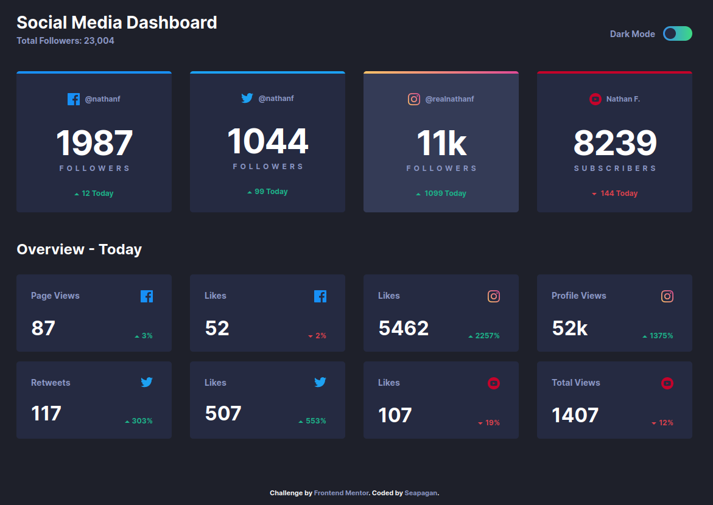

# Frontend Mentor - Social media dashboard with theme switcher solution  <!-- omit in toc -->

This is a solution to the [Social media dashboard with theme switcher challenge on Frontend Mentor](https://www.frontendmentor.io/challenges/social-media-dashboard-with-theme-switcher-6oY8ozp_H). Frontend Mentor challenges help you improve your coding skills by building realistic projects.

## Table of contents <!-- omit in toc -->

- [Overview](#overview)
  - [The challenge](#the-challenge)
  - [Screenshot](#screenshot)
  - [Links](#links)
- [My process](#my-process)
  - [Built with](#built-with)
  - [What I learned](#what-i-learned)
  - [Continued development](#continued-development)
- [Author](#author)

## Overview

### The challenge

Users should be able to:

- View the optimal layout for the site depending on their device's screen size
- See hover states for all interactive elements on the page
- Toggle color theme to their preference

### Screenshot

### Links

- Live Site URL: [GitHub Pages](https://seapagan-fem.github.io/social-media-dashboard/)
- Solution URL: [Frontend Mentor](https://your-live-site-url.com)

## My process

### Built with

- Semantic HTML5 markup
- CSS custom properties
- Flexbox
- CSS Grid
- Mobile-first workflow

### What I learned

Coding the dark/light mode was so much easier than I'd imagined, with a little
thought. Simply have 2 classes each containing variables for that theme's colors,
and use these variables throughout. Then a little JS to add the correct
class to the `<body>` element and done!

I researched how to detect the user's dark/light mode preference in the
Operating System, and took advantage to choose the default mode based on this.
Doesn't seem to work properly in Chrome (at least on Ubuntu desktop), for
further investigation!

### Continued development

After submission I plan to re-write to take the data from an local JSON file, to
simulate using an API (values are hard-coded at the moment as per the challenge)

## Author

- Website - [Grant Ramsay](https://www.gnramsay.com)
- Frontend Mentor - [@seapagan](https://www.frontendmentor.io/profile/seapagan)
- Twitter - [@gnramsay_dev](https://www.twitter.com/gnramsay_dev)
